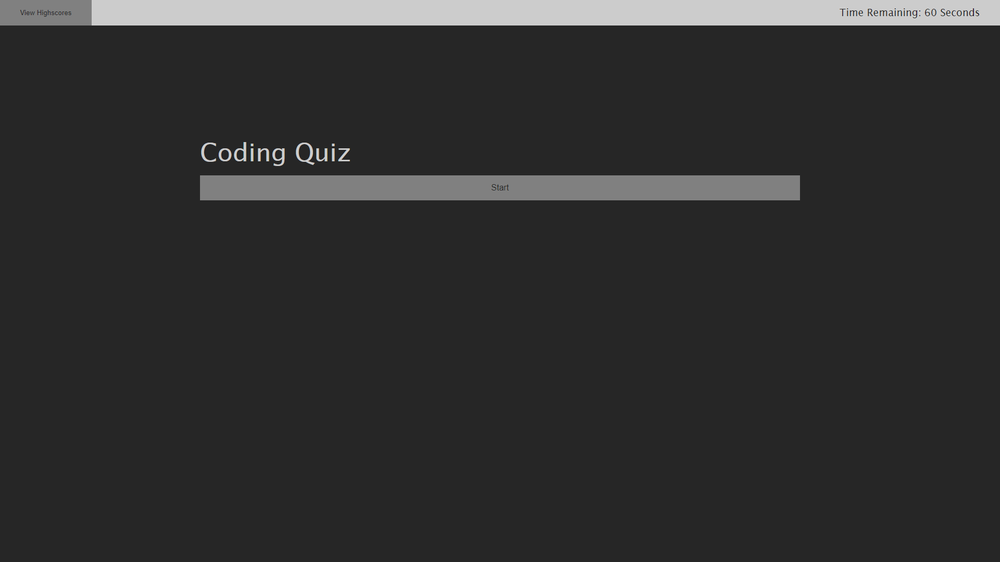

# HW4 Code Quiz 
## Description

This is a JS quiz built using HTML, CSS, and Javascript.

## Contents
- [Installation](#installation)
- [Usage](#usage)
- [License](#license)
- [Contact](#contact)
## Installation
Go to the github pages deploy.
## Usage
To start the quiz, press start quiz. To view prior scores saved on your machine, press view scores. Once the quiz has started, select the correct answer to move on to the next question. If you select the wrong answer, five seconds will be removed from your remaining time. Once you answer all five questions, the quiz will prompt you for your initials and score you based on your remaining time. If you run out of time, your score will be zero. The quiz will display all prior saved scores at the end of the quiz. To play again, select go home and then start quiz.

## License
The project uses the [Do WTF You Want To](http://www.wtfpl.net/) license.
## Contact
Link to my github: [sagegrayson](https://github.com/sagegrayson)

If you'd like to contact me, email me at [skaseyg@gmail.com](mailto:skaseyg@gmail.com)
